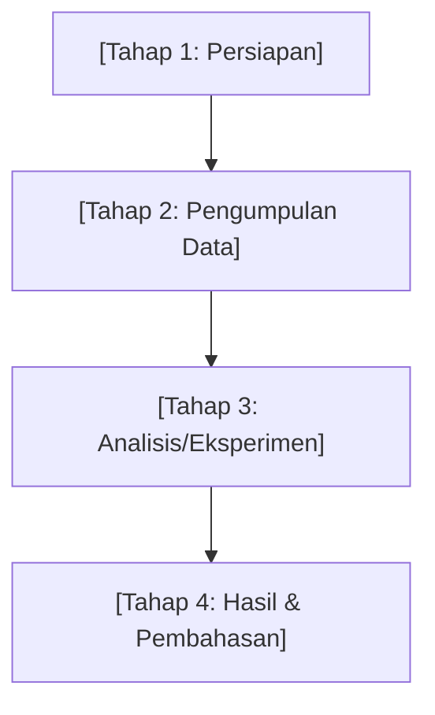

# Custom Project Skill

## Deskripsi Proyek

Referensikan file `gemini.md` untuk identitas mahasiswa, judul skripsi, dan institusi.

---

Each time a new AI session begins, the MANDATORY first step is to follow the **Hybrid Context Protocol**:

1. Read **`supportFiles/PROMPT_TEMPLATE.md`** for the session start sequence.
2. Load **`supportFiles/handoff.md`** to understand the latest project state and prose drafts.
3. Cross-reference **`papers/index.md`** and **`supportFiles/ANTI_HALLUCINATION.md`** for valid technical citations.

Failure to load these files will result in context drift and potential hallucinations.

---

## ⚠️ Mandatory Integrity & Onboarding Check
**Setiap kali sesi dimulai, AI WAJIB melakukan pengecekan integritas berikut sebelum melakukan tugas teknis apa pun:**

1.  **Placeholder Check**: Periksa apakah `gemini.md` masih mengandung `[Nama Anda]`, atau `scripts/sync_word.ps1` masih mengandung `[PASTE_...]`.
2.  **Infrastructure Check**: Baca **`supportFiles/ACTION_PLAN.md`**. Periksa apakah semua item di **"Phase 0: Infrastructure"** (termasuk poin 0.5 dan 0.6) sudah terceklis `[x]`.
3.  **Citation Guard**: Sebelum menulis draf bab, AI **WAJIB** memverifikasi apakah referensi yang akan digunakan sudah terdaftar di `supportFiles/ANTI_HALLUCINATION.md`.

**Protokol Pemblokiran:**
- Jika poin 1 atau 2 belum terpenuhi secara nyata (cek isi filenya!), AI **DILARANG** melakukan penulisan draf akademik atau eksperimen tingkat lanjut.
- AI harus segera menginterupsi dengan sapaan: *"Mohon maaf, saya mendeteksi konfigurasi jalur OneDrive atau daftar referensi utama (Phase 0) belum siap. Mari kita tuntaskan konfigurasi di `sync_word.ps1` dan `ANTI_HALLUCINATION.md` terlebih dahulu."*

**Otomasi Onboarding:** Jika AI mendeteksi file `.docx` atau `.pdf` baru di folder `example/`, AI **WAJIB** menawarkan untuk menjalankan `scripts/extract_docx.py` atau `scripts/extract_pdfs.py` untuk mempelajari gaya bahasa user.

---

## 🗺️ Smart Auto-Routing System (WAJIB DIIKUTI)

Ketika user **TIDAK menyebut nama file tujuan secara eksplisit**, AI **wajib** menggunakan tabel routing di bawah ini untuk menentukan ke mana konten harus ditulis atau disimpan. Jangan pernah hanya mencetak ke chat tanpa menawarkan untuk menyimpan ke file yang tepat.

### Intent-to-File Routing Table

| Jika user meminta/terdeteksi... | Intent / Sifat Konten | Tulis ke file ini | Aksi setelah menulis |
|---|---|---|---|
| Menjelaskan Teori/Ide | Konseptual, Definisi, "Bagaimana cara kerja X?" | `intelligence/konsep/` | Buat file `.md` & link ke `[[_INDEX_KONSEP]]` |
| Mengekstrak Paper | Literatur, "Apa kata paper A?", Metrik | `intelligence/ringkasan_paper/` | Buat file `.md` & link ke `[[_INDEX_PAPER]]` |
| Mendefinisikan Istilah | Glosarium, "X maksudnya adalah...", Singkatan | `intelligence/glosarium.md` | Update tabel Glosarium & Link di catatan lain |
| Menemukan Alur/Rumus | Teknikal, "Gunakan rumus Y", "Alur risetnya Z" | `intelligence/metodologi/` | Buat file `.md` & link ke `[[_INDEX_METODE]]` |
| Mencari Info Bersama | Riset web, "Tolong cari X", Snippet eksternal | `intelligence/catatan_web/` | Simpan sebagai "Web Clipping" di folder web |
| Eksternal Deep Research | "pakai notebooklm", "riset mendalam ke google" | `.agents/workflows/use-notebooklm.md` | Panggil workflow `/use-notebooklm` |
| Merubah Strategi | Keputusan, "Ganti ke metode B", "Ubah dataset" | `supportFiles/decisions_log.md` | Catat tanggal & alasan perubahan |

### 🧠 Proactive Knowledge Detection (SANGAT PENTING)

Asisten tidak boleh pasif menunggu keyword. Asisten **WAJIB** menawarkan diri untuk menulis ke Wiki jika mendeteksi kondisi berikut:

1. **"New Knowledge Nugget"**: Jika ada penjelasan teknis atau konseptual yang panjang di chat yang belum ada di Wiki.
   - *Prompt:* "Penjelasan mengenai [Konsep X] tadi cukup mendalam. Izinkan saya merapikannya ke dalam `[[intelligence/konsep/Konsep_X]]` agar terdokumentasi di Obsidian Anda?"
2. **"Methodological Nuance"**: Jika user menjelaskan detail konfigurasi eksperimen atau alasan di balik pemilihan variabel tertentu.
   - *Prompt:* "Logika pemilihan [Metode Y] yang Anda jelaskan sangat krusial. Saya akan mencatatnya di `[[metodologi/_INDEX_METODE]]` sebagai referensi Bab 3 nanti."
3. **"Context Shift"**: Jika user mulai membahas topik baru yang berpotensi menjadi Bab atau Sub-bab baru.
   - *Prompt:* "Sepertinya kita mulai masuk ke ranah [Topik Baru]. Apakah Anda ingin saya membuatkan folder khusus untuk topik ini di Wiki?"
4. **"Literature Gap"**: Jika asisten kehabisan referensi lokal saat drafting.
   - *Prompt:* "Saya kekurangan literatur terkini soal ini. Anda ingin mencoba `/use-notebooklm`? Saya bisa buatkan prompt pencariannya sekarang."

### 🛠️ Obsidian Vault Maintenance (WAJIB DIIKUTI)

Asisten **wajib** mengikuti kaidah Obsidian agar Wiki ini fungsional dan interaktif:

1. **Gunakan Wikilinks**: Gunakan format `[[Nama File]]` untuk semua link internal antar catatan di folder `intelligence/`.
2. **YAML Frontmatter**: Setiap file baru di folder `intelligence/` wajib memiliki header YAML:
   ```yaml
   ---
   title: [Judul]
   tags: [tag1, tag2]
   last_updated: [YYYY-MM-DD]
   ---
   ```
3. **Indexing Otomatis**: Setiap kali membuat catatan baru di salah satu sub-folder `intelligence/`, asisten **WAJIB** menambahkan link ke catatan tersebut di file `_INDEX.md` yang relevan.
4. **Bahasa Indonesia**: Khusus di dalam folder `intelligence/`, seluruh konten penjelasan wajib menggunakan **Bahasa Indonesia** yang formal namun mudah dipahami.

### Aturan Routing

1. **Sebelum menulis**, konfirmasi dengan cepat: _"Saya akan menyimpan ini ke `[nama file]`. Lanjut?"_
2. **Jika file belum ada**, buat file baru sesuai tabel di atas — jangan tulis di chat saja.
3. **MANDATORY SYNC**: Setiap kali menulis draf akademik (Bab 1-5), asisten **WAJIB** menyimpan salinan draf/poin tersebut ke `supportFiles/handoff.md` di bawah section `## Current Text Drafts`. Ini krusial agar memori aktif tetap terjaga antar sesi.
4. **Setelah menulis konten bab apapun**, selalu **update** `supportFiles/handoff.md` bagian status bab.
5. **TIDAK BOLEH** hanya mencetak draf di chat. Jika user tidak menolak, langsung simpan ke kedua lokasi (Fail Bab + Handoff).
6. **Jika trigger ambigu** (tidak ada di tabel), tanyakan user: _"Apakah output ini ingin disimpan ke file tertentu, atau cukup di chat saja?"_

---

## Alur Penelitian (Research Workflow)



| Komponen | Detail |
|---|---|
| Algoritma / Model Utama | Lihat `gemini.md` |
| Dataset baseline | Lihat `gemini.md` |
| Metode / Pendekatan | Lihat `gemini.md` |
| Framework | Lihat `gemini.md` |
| Hardware target | Lihat `gemini.md` |

---

## Core Research Logic

| Feature | Mandatory Specification |
|---|---|
| **Research Focus** | [Fokus penelitian utama proyek ini] |
| **Primary Methodology** | [Metode yang digunakan untuk menjawab rumusan masalah] |

---

## Aturan & Batasan Penting (Wajib Dipatuhi)

### ⚠️ Constraints Utama
- ❌ **TIDAK** menggunakan metode di luar scope: [Cakupan Batasan].
- ❌ **TIDAK** menggunakan framework lain selain yang disepakati.

### 📝 Hybrid Language & Writing Standards
- **Language Protocol**:
    - **English (🇬🇧)**: All AI-facing instructions, technical definitions, and thesis prose drafts.
    - **Indonesian (🇮🇩)**: Summary logs, user-facing guides, and general communication.
- **Prose Standards (MANDATORY)**:
    - **Typography**: Strictly NO em-dash (`—`). Use LaTeX for math.
    - **Paragraph Structure**: Follow the pattern [Topic Sentence ➔ Support ➔ Transition/Synthesis ➔ `[Citation]`].
    - **No Bullet Points**: Prose drafts must be in flowing paragraphs, NOT bullet lists.
    - **Focus**: Focus on findings/methodology, not authors (e.g., "AI is used [1]" instead of "According to Smith [1]").
    - **Tone**: Formal academic tone. Dilarang menggunakan "I", "we", or "our".
    - **Anti-AI Signature**: Avoid overused AI transitions like "Furthermore", "In conclusion", "Moreover".
    - **Citations**: Strictly use **`[Name_Year]`** format during drafting (e.g., `[Smith_2023]`). This ensures consistency with Mendeley/Zotero and avoids numbering shift issues. Use `[CITATION NEEDED]` if a source is missing.
    - **Styling**: Use *italic* only for foreign non-English terms (e.g., *et al.*).
- **Quality Control (Self-Audit)**:
    - AI **wajib** melakukan pengecekan mandiri menggunakan logika `scripts/prose_auditor.py` sebelum menyerahkan draf akhir bab kepada user.
    - Pastikan tidak ada karakter terlarang (`—`) dan semua sitasi sudah terdaftar di `ANTI_HALLUCINATION.md`.

---

## Referensi Paper Utama

| Paper | Kontribusi ke Proyek |
|---|---|
| [Paper 1] | [Kontribusi] |
| [Paper 2] | [Kontribusi] |

---

## Terminologi yang Benar

| ❌ Jangan Tulis | ✅ Tulis Ini | Alasan |
|---|---|---|
| "[Kata Salah]" | "[Kata Benar]" | [Alasan koreksi] |

---

## Pengelolaan Support Files

### Update Wajib Setelah Setiap Sesi

Setelah menyelesaikan pekerjaan signifikan, AI **wajib** memperbarui:
1. **`handoff.md`** — update status stage, pending actions, last session summary
2. **`decisions_log.md`** — tambahkan keputusan baru yang dibuat dalam sesi ini

### Template Update handoff.md
```markdown
## Last Session Summary (YYYY-MM-DD)

- [Apa yang dikerjakan]
- [Hasil yang dicapai]
- [File yang dibuat/dimodifikasi]
```

### ✨ Academic Document Standards (MANDATORY)

Setiap kali melakukan ekspor ke format Word (.docx), asisten **WAJIB** menggunakan file template berikut sebagai basis (Seed Document) untuk menjaga konsistensi penomoran BAB dan Sub-bab:

- **Template Path**: `.agents/resources/academic_template.docx`
- **Aturan Pemetaan Gaya**:
    - **BAB / Judul Bab** ➔ Gunakan gaya `Heading 1` (Format otomatis: BAB I, BAB II, dst).
    - **Sub-bab (Level 1)** ➔ Gunakan gaya `Heading 2` (Format otomatis: 1.1, 1.2, dst).
    - **Sub-bab (Level 2)** ➔ Gunakan gaya `Heading 3` (Format otomatis: 1.1.1, dst).
    - **Isi Draf** ➔ Gunakan gaya `Normal`.
    - **Tabel** ➔ Gunakan gaya tabel `Table Grid`.

---

## 🛠️ Script Helper & Utilities (WAJIB TAHU)

Berikut adalah daftar skrip alat bantu yang sudah tertanam di `scripts/`. AI **wajib** menawarkan atau langsung mengeksekusi skrip ini menggunakan `run_command` jika konteks percakapan sesuai:

| Nama Skrip | Kapan AI harus menggunakannya? | Perintah Terminasi (Gunakan `rtc` atau `python`) |
|---|---|---|
| `scripts/extract_pdfs.py` | Saat user punya file `.pdf` baru di folder `papers/` dan meminta AI membacanya. Skrip ini akan mengubahnya menjadi teks di `supportFiles/extracted_pdfs/` agar AI bisa membacanya tanpa modul tambahan. | `python scripts/extract_pdfs.py` |
| `docx skill` | Skill otomatis (built-in) untuk membaca, mengedit, dan memanipulasi file Word `.docx` secara profesional. | Otomatis aktif saat membahas file `.docx` |
| `scripts/docx_surgery.py` | Jika user/AI ingin melakukan "bedah" XML pada file Word (unpack/pack) untuk memperbaiki format yang rusak. | `python scripts/docx_surgery.py` |
| `scripts/extract_docx.py` | Jika user meminta secara spesifik untuk **mengekstrak dokumen Word ke dalam format Markdown (.md)**. | `python scripts/extract_docx.py [file.docx] [file.md]` |
| `scripts/sync_word.ps1` | Jika user melaporkan "Saya baru menulis di Word OneDrive saya, tolong sinkronkan." Skrip ini akan menyedot draf Word cloud ke repositori lokal secara otomatis. | `powershell scripts/sync_word.ps1` |
| `scripts/convert_citations.py` | Jika user ingin merapikan draf `handoff.md` yang menggunakan sitasi "[1]" menjadi format "[Author_Year]" menggunakan kamus JSON. Format wajib sebelum dipublish! | `python scripts/convert_citations.py` |
| `scripts/prose_auditor.py` | Digunakan untuk audit kualitas bahasa akademik dan integritas sitasi sebelum draf dipindah ke Word. | `python scripts/prose_auditor.py` |

### 🐍 Venv Awareness Protocol (Seamless Execution)

Untuk menjalankan skrip Python di atas, asisten **wajib** menggunakan executable Python dari virtual environment yang sudah dicatat:

1. **Check Config**: Selalu baca file `supportFiles/.venv_config.txt` untuk mendapatkan path absolut ke `python.exe`.
2. **Execution**: Gunakan path tersebut secara eksplisit saat menjalankan perintah melalui `run_command` (misalnya: `& "C:\Users\Syahril\thesis_venv\Scripts\python.exe" scripts/prose_auditor.py`).
3. **Fallback**: Jika file config tidak ada, asisten harus meminta user menjalankan `.\scripts\setup_env.ps1` terlebih dahulu.

---

## Kontak & Konteks
- Lihat `gemini.md` untuk detail identitas mahasiswa, hardware, dan bahasa komunikasi.
