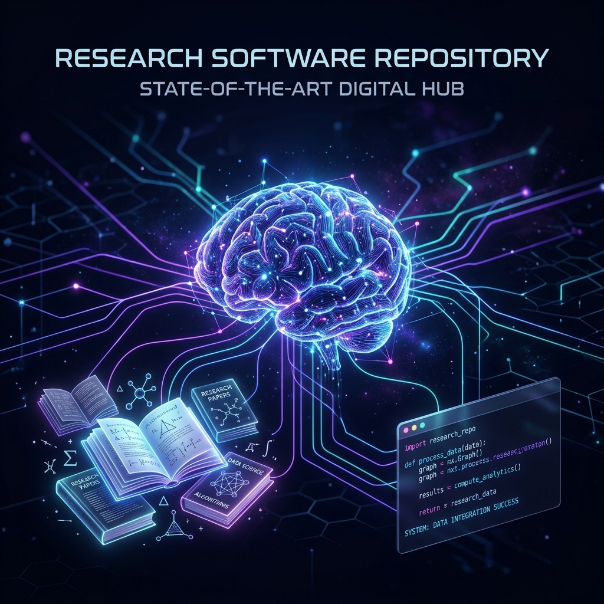

# 🎓 Project Template: Collaborative Research & Coding

<div align="center">
  
</div>

Selamat datang di workspace proyek ini! Directory ini telah disiapkan sebagai template standar untuk pengerjaan penelitian, skripsi (TA), atau proyek coding kolaboratif dengan bantuan AI Agent.

---

## 🚀 Quick Start (Windows)
Siapkan lingkungan riset Anda dalam satu klik:
```powershell
.\scripts\setup_env.ps1
```

**Penting:** Setelah setup selesai, silakan ikuti panduan **[GETTING_STARTED.md](./GETTING_STARTED.md)** untuk mulai melakukan riset dengan bantuan AI.

## ✨ Fitur Unggulan
- **📝 Handoff-Centric Drafting**: Seluruh draf terkonsentrasi di satu titik (`supportFiles/handoff.md`) untuk meminimalkan halusinasi AI.
- **👥 Research Bureau**: Sistem multi-agent (Dr. Aulia, Baskoro, Citra, Deni) dengan persona spesialis untuk setiap tahap riset.
- **🧠 Intelligence Vault (Obsidian)**: Pusat pengetahuan interaktif dengan grafik hubungan antar konsep (`intelligence/`).
- **☁️ Automated Literature Ingestion**: Workflow sinkronisasi Google NotebookLM untuk "memanen" puluhan PDF jurnal hasil Deep Research secara masal dan mengekstrak metriknya otomatis.
- **🗺️ Optional Graphify**: Knowledge Graph visual untuk memetakan arsitektur riset (Via Node.js).
- **⚖️ Prose Auditor**: Skrip detektif (`scripts/prose_auditor.py`) untuk membasmi karakter "robot" AI dan memverifikasi integritas sitasi.
- **🔄 Global Brain Sync**: Sinkronisasi draf cerdas antara Markdown, Word, dan Obsidian via OneDrive.

---

## 📂 Struktur Folder & Fungsi

**Last updated:** 2026-04-23
 
 Berikut adalah penjelasan fungsi untuk tiap directory agar pengerjaan tetap rapi dan terorganisir:
 
 | Directory | Fungsi | Contoh Isi |
 |---|---|---|
 | `notebooks/` | Eksperimen, eksplorasi data, dan riset interaktif. | `.ipynb` file |
 | `scripts/` | Automation, sync OneDrive (`sync_global_brain.ps1`), dan audit. | `.py`, `.ps1`, `.bat` |
 | `models/` | Penyimpanan artefak hasil perhitungan, model, atau bobot utama. | `.pth`, `.pt`, `.onnx`, `.bin` |
 | `results/` | Output evaluasi, metrik hasil, grafik visualisasi, dan file log. | `.csv`, `.png`, `.log` |
 | `references/` | Koleksi literatur utama (jurnal/prosiding) yang menjadi dasar riset. | `artikel.pdf` |
 | `reference/` | Materi pendukung seperti dokumentasi atau potongan kode referensi. | `.pdf`, `.md`, `.txt` |
 | `dataset/` | Data mentah (raw) atau data yang sudah diproses untuk riset. | `data/`, `images/`, `tables/` |
 | `example/` | Demo singkat untuk memastikan sistem berjalan. | `demo.py`, `test_env.py` |
 | `image/` | Aset gambar untuk dokumentasi README dan hero poster. | `.jpg`, `.svg` |
 | `intelligence/` | **LLM Wiki (Obsidian Vault)**: Pusat memori AI, konsep, & sintesis. | `_INDEX.md`, `konsep/` |
 | `supportFiles/` | Konfigurasi pendukung, tracker revisi, dan draf modular (`handoff/`). | `handoff/`, `open_questions.md` |
 | `.agents/` | Pusat kontrol AI (Aturan, Skill, Workflow, & **Research Bureau**). | `skills/`, `workflows/`, `plugins/` |

---

## 🤖 Menggunakan AI Assistant (Antigravity)

Proyek ini dilengkapi dengan asisten AI yang bisa membantu menulis subbab laporan, menjelaskan kode, hingga melakukan riset otomatis.

- **Panduan Cepat**: Lihat file [HOW_TO_USE_ANTIGRAVITY.md](./HOW_TO_USE_ANTIGRAVITY.md) untuk mempelajari cara memanggil workflow asisten.
- **Support**: Asisten ini memahami konteks proyek melalui file-file di directory `.agents`.

---
*Developed with ❤️ as a Universal Research Template.*
